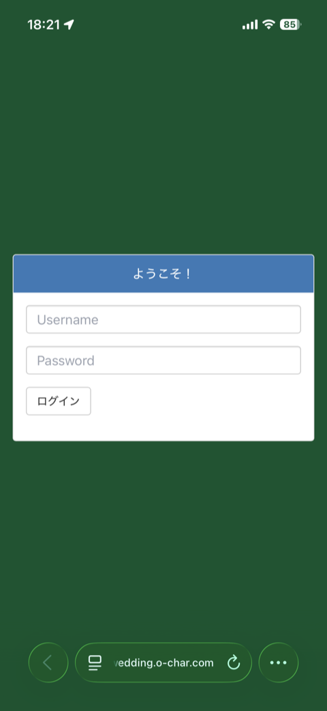
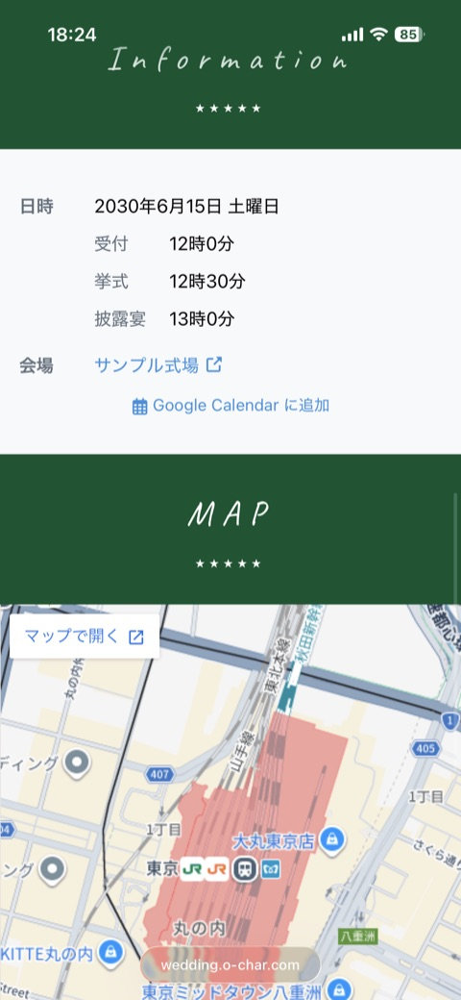
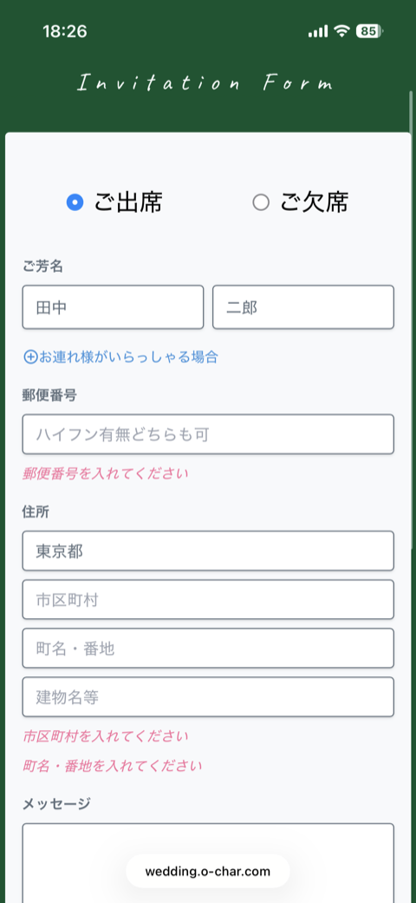
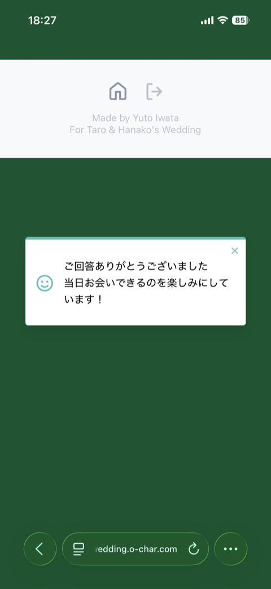
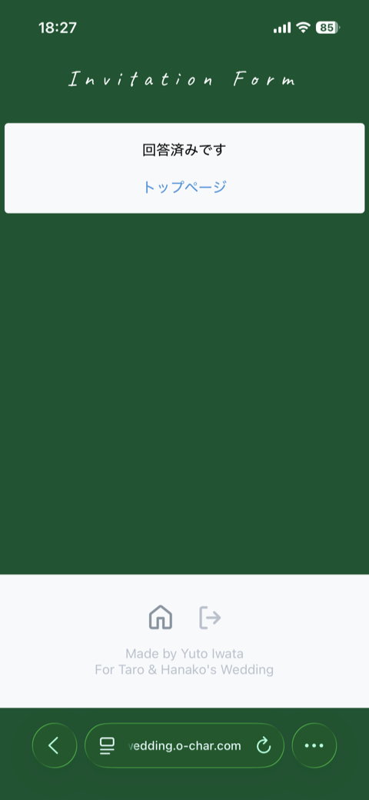

# Wedding App

結婚式の Web 招待状アプリケーションです。招待客は管理者が発行・配布した ID でログインし、出欠・参列者・住所・メッセージを回答します。

2023 年 9 月から 12 月にかけて個人開発し、**2024 年に実際の結婚式で運用しました**。参列者からの回答受付、当日の案内表示まで一通りの役割を終えています。2026年に Claude を活用してソースコードを公開できるように修正の上、こちらで公開しています。

> [!NOTE]
> 公開にあたり、新郎新婦の氏名・写真・会場名・日時・式場が発行した URL はすべてサンプルの値に置き換えてあります。
> 実際に運用した際の設定値は `src/configuration.local.js`（Git 管理外）に置いていました。

## デモ

<https://wedding.o-char.com> で**デモモード**のビルドを公開しています。認証と API をモックに差し替えてあるので、任意の ID とパスワードでログインし、招待状の閲覧から出欠回答の送信・回答済み画面までを一通り試せます。回答はブラウザの `sessionStorage` にのみ保存され、どこにも送信されません。

## スクリーンショット

| ログイン | 招待状（カバー・招待文） | 日時・会場・地図 |
| :---: | :---: | :---: |
|  |  |  |

| 出欠回答フォーム | 送信完了 | 回答済み画面 |
| :---: | :---: | :---: |
|  |  |  |

## 主な機能

- **招待制のアクセス** — Amazon Cognito User Pool に管理者がゲストごとのアカウントを作成し、ログインしたユーザーだけが招待状を閲覧できる（サインアップは開放していない）
- **招待状（ダッシュボード）** — カバー画像、招待文、日時・会場の案内、Google カレンダーへの追加リンク、Google Maps の埋め込み
- **カウントダウン** — 挙式前・開催中・終了後の 3 状態で表示を出し分ける
- **出欠回答フォーム** — 出欠、氏名、同伴者（可変長）、郵便番号、住所、メッセージ、備考を送信。都道府県名の実在チェックを含むバリデーション付き
- **回答済み状態の管理** — ログイン時に回答済みかを取得し、回答済みなら結果に応じた画面を表示する

## 技術スタック

| 領域 | 使用技術 |
| --- | --- |
| フレームワーク | React 18 / Create React App 5 |
| 状態管理 | Redux / Redux Toolkit / Redux Form |
| ルーティング | React Router v6 |
| スタイリング | styled-components / Tailwind CSS v3 |
| 認証・API 通信 | AWS Amplify (Auth / API) |
| 日付処理 | Luxon |
| バックエンド | Amazon Cognito / Amazon API Gateway / Amazon DynamoDB |
| ホスティング | Amazon S3 + Cloudflare |

## アーキテクチャ

```text
ブラウザ
  │
  ├─ Cloudflare ──▶ Amazon S3（静的ウェブサイトホスティング）
  │                   SPA の配信
  │
  ├─ Amazon Cognito User Pool
  │    ゲストごとのログイン
  │
  └─ Amazon API Gateway ──▶ Amazon DynamoDB
       GET  /invitation-answers/{userId}   回答済みかどうかの取得
       POST /invitation-answers            出欠回答の保存
       （Lambda を介さず、マッピングテンプレートで DynamoDB と直接統合）
       （IAM 認可。Amplify が Identity Pool のクレデンシャルで SigV4 署名する）
```

利用者と外部サービス（Cognito・Google Maps・Google カレンダー・式場のサイト）まで含めた全体像は、C4 モデルの System Context 図として [docs/architecture/](docs/architecture/) にまとめてあります。Structurizr DSL（[workspace.dsl](docs/architecture/workspace.dsl)）を正として Mermaid を生成しています。

バックエンド（Cognito・API Gateway・DynamoDB）と S3 バケットは当初 AWS コンソール上で構築しましたが、その設定値を読み取って [infra/](infra/) に Terraform のコードとして起こしてあります。既存リソースは `import` で Terraform の管理下に取り込む前提なので、新規作成にも再現にも使えます。詳細は [infra/README.md](infra/README.md) を参照してください。

## 実装のポイント

- **`withAuthenticator` の独自ラップ** — `aws-amplify-react` の `Authenticator` をラップし、認証状態を Redux に反映させたうえで、ログイン直後に回答済みかどうかを API から取得している（[src/components/Amplify/withAuthenticator.js](src/components/Amplify/withAuthenticator.js)）
- **設定値の一元化** — 氏名・会場・日時といった式ごとに変わる値をすべて `src/configuration.local.js` に集約し、コンポーネントにハードコードしない。式場が発行する URL は未設定なら案内ごと非表示になる
- **デモモード** — `aws-amplify` の `Auth` / `API` はシングルトンで、`aws-amplify-react` の `SignIn` も同じインスタンスを参照している。デモモードでは起動時にそのメソッドをモックで上書きし（[src/demo/install.js](src/demo/install.js)）、コンポーネント側を変更せずに Cognito / API Gateway への通信を `sessionStorage` に置き換えている。設定値も Git 管理下の [src/configuration.demo.js](src/configuration.demo.js) に切り替わるため、ローカルの実運用値がデモビルドに混入しない
- **API Gateway のエスケープ対策** — マッピングテンプレート経由で JSON が壊れる問題への暫定対処として、送信前に改行・引用符・波括弧を除去している（`removeJSONInvalidChars`。[src/features/Invitation/Invitation.js](src/features/Invitation/Invitation.js)）
- **同伴者の可変長入力** — Redux Form の `FieldArray` で、同伴者を必要な人数だけ追加・削除できるようにしている

## セットアップ

```bash
cp src/configuration.demo.js src/configuration.local.js   # 設定ファイルを作成し、値を埋める
yarn install
yarn start
```

`src/configuration.local.js` には Cognito と API Gateway の情報が必要です。これらが未設定だとログイン画面から先に進めません。

### デモモードで動かす

AWS のリソースを用意しなくても、デモモードなら手元で一通り動かせます。設定値には `src/configuration.demo.js` が使われるので、`src/configuration.local.js` を用意する必要はありません。

```bash
yarn install
yarn start:demo
```

## スクリプト

| コマンド | 内容 |
| --- | --- |
| `yarn start` | 開発サーバーを起動（<http://localhost:3000>） |
| `yarn start:demo` | デモモードで開発サーバーを起動 |
| `yarn build` | `build/` に本番ビルドを出力 |
| `yarn build:demo` | `build/` にデモモードのビルドを出力 |
| `yarn lint` | ESLint を実行 |
| `yarn build-tailwind` | `src/index.tailwind.css` から `src/index.css` を生成（start / build の前に自動実行される） |

## デプロイ

S3 の静的ウェブサイトホスティングへ同期するスクリプトを同梱しています。

```bash
cp .deployrc{.sample,}   # プロファイル名とバケット名を記入する（git 管理外）
bin/deploy               # .deployrc の設定でビルドとアップロードを実行
```

引数で直接指定することもできます。

```bash
bin/deploy <aws-profile> <s3-bucket>
```

`.deployrc` に `DEPLOY_DEMO_MODE=true` を書く（または環境変数で渡す）と、デモモードのビルドを配信します。

ビルド後に `s3 sync --delete` で配信し、`index.html` / `manifest.json` / `service-worker.js` だけキャッシュを無効化します。CDN（CloudFront や Cloudflare）を挟んでいる場合は、別途キャッシュのパージが必要です。

## ディレクトリ構成

```text
src/
├── actions/            Redux のアクションクリエイター
├── reducers/           Redux のリデューサー
├── components/         アプリ全体で使う共通コンポーネント
│   └── Amplify/        Amplify の認証 UI をラップしたもの
├── features/
│   ├── Dashboard/      招待状の表示（カバー・招待文・案内・地図・カウントダウン）
│   └── Invitation/     出欠回答フォームと回答済み画面
├── demo/               デモモード用の認証・API のモック
├── configuration.js         設定値の切り替え（通常モードは local、デモモードは demo を使う）
├── configuration.demo.js    サンプル兼デモモードの設定値
├── configuration.local.js   式ごとの設定値（Git 管理外）
└── colors.js           Tailwind と共有するカラーパレット
```

## 既知の制約

- aws-amplify は当時の実装をそのまま残しており、バージョンが古いままです。
- 自動テストは整備していません。

## クレジット

カバー画像は [Unsplash](https://unsplash.com/) の写真を Unsplash License のもとで使用しています。詳細は [CREDITS.md](CREDITS.md) を参照してください。

プロジェクト <https://github.com/upinetree/wedat-demo> も参考に作成しています。

## ライセンス

[MIT License](LICENSE)
