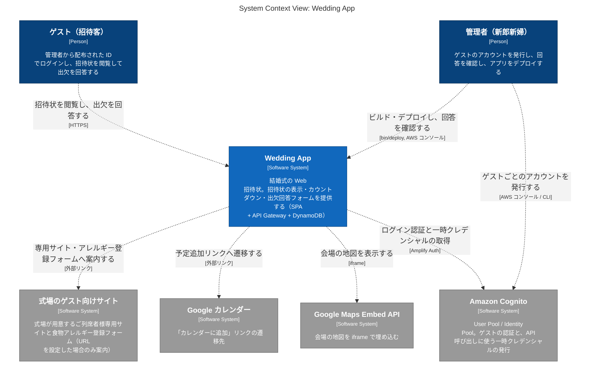

# architecture

Wedding App の構成を [C4 モデル](https://c4model.com/) で図示したものです。
現在は最上位の **System Context 図**（システムと利用者・外部システムの関係）だけを用意しています。
Container 図（SPA / API Gateway / DynamoDB の内訳）以下は必要になった時点で `workspace.dsl` に追記します。

| ファイル | 役割 |
| --- | --- |
| [workspace.dsl](workspace.dsl) | Structurizr DSL。**図の正**はこのファイルで、要素・関係・見た目はここで編集する |
| [structurizr-SystemContext.mmd](structurizr-SystemContext.mmd) | `workspace.dsl` から生成した Mermaid。手で編集しない |
| [export.sh](export.sh) | Docker で `workspace.dsl` を検証し、Mermaid を再生成するスクリプト |

## System Context 図



### 読み方

- **ゲスト（招待客）** — 管理者が配布した ID でログインし、招待状の閲覧と出欠回答をする
- **管理者（新郎新婦）** — Cognito にゲストのアカウントを発行し、`bin/deploy` でアプリを配信し、回答を AWS コンソール（DynamoDB）で確認する
- **Wedding App** — このリポジトリ。SPA（S3 + Cloudflare）、API Gateway、DynamoDB をまとめて 1 つのシステムとして扱う。内訳は Container 図の粒度なのでここでは描かない
- **Amazon Cognito** — 認証基盤。アプリの一部ではなく利用する外部サービスとして描いている
- **Google Maps Embed API / Google カレンダー / 式場のゲスト向けサイト** — 招待状から埋め込み・リンクで参照する外部サービス。式場サイトは `guestSiteUrl` / `allergyFormUrl` を設定した場合だけ案内が出る

## 図の更新手順

`workspace.dsl` を編集したら、Mermaid を再生成して **この README の `mermaid` ブロックも差し替え**、まとめてコミットします。

```bash
docs/architecture/export.sh   # Docker が必要。validate → export の順に実行する
```

- Docker イメージは [structurizr/structurizr](https://hub.docker.com/r/structurizr/structurizr) を使う。旧 `structurizr/cli` は非推奨化され、バナーを出すだけで動かない
- 出力ファイル名は `structurizr-<ビューのキー>.mmd`。ビューを増やしたらファイルも増える
- Mermaid の出力は `graph`（flowchart）形式で、Mermaid 独自の `C4Context` 記法ではない。GitHub と VS Code の Markdown プレビューでそのまま描画できる

Structurizr の公式ツールでも `workspace.dsl` をそのまま開けます。

```bash
# ブラウザで http://localhost:8080 を開くと、レイアウトを調整しながら図を確認できる
docker run --rm -p 8080:8080 -v "$(pwd)/docs/architecture:/usr/local/structurizr" structurizr/structurizr local
```
