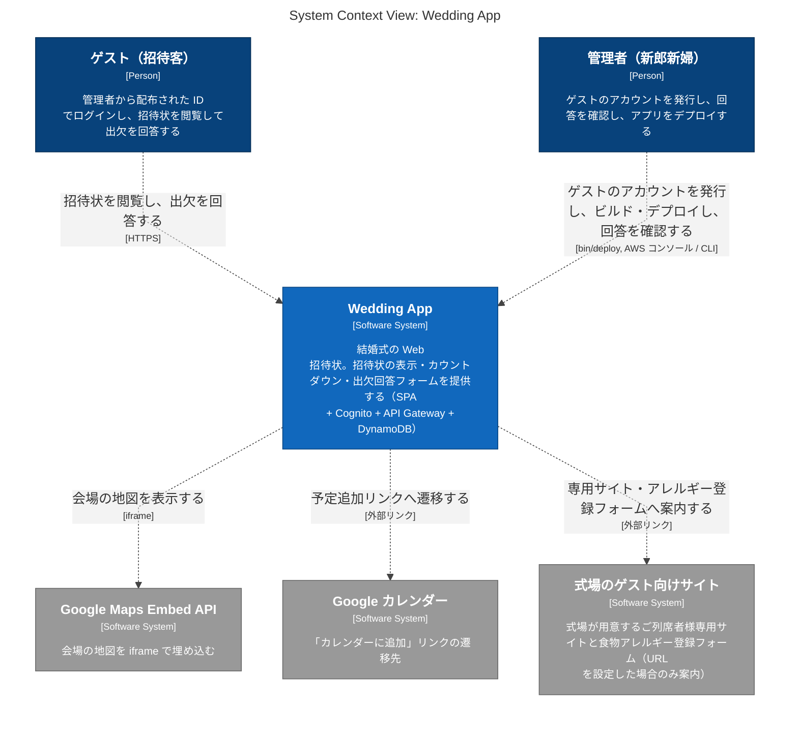
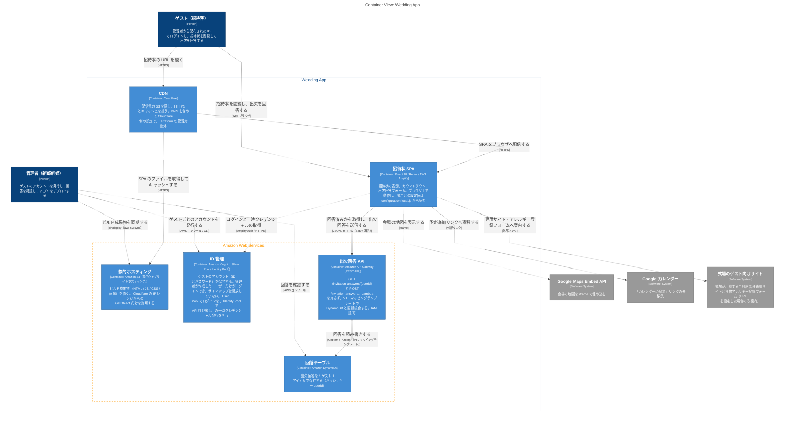

# architecture

Wedding App の構成を [C4 モデル](https://c4model.com/) で図示したものです。
上位 2 レベル、**System Context 図**（システムと利用者・外部システムの関係）と
**Container 図**（システムを構成する実行単位とデータストア）を用意しています。
Component 図（SPA 内部のコンポーネント分割）は必要になった時点で `workspace.dsl` に追記します。

| ファイル | 役割 |
| --- | --- |
| [workspace.dsl](workspace.dsl) | Structurizr DSL。**図の正**はこのファイルで、要素・関係・見た目はここで編集する |
| [structurizr-SystemContext.mmd](structurizr-SystemContext.mmd) | System Context 図の Mermaid。`workspace.dsl` から生成するので手で編集しない |
| [structurizr-Containers.mmd](structurizr-Containers.mmd) | Container 図の Mermaid。同上 |
| [export.sh](export.sh) | Docker で `workspace.dsl` を検証し、Mermaid を再生成するスクリプト |

## System Context 図

システムを 1 つの箱として扱い、誰が使い、どの外部サービスに依存しているかを示します。


```mermaid
%%{init: {"flowchart": {"curve": "linear"}}}%%
graph LR
  linkStyle default fill:none,stroke:#444444

  subgraph diagram ["System Context View: Wedding App"]
    style diagram fill:#ffffff,stroke:#ffffff

    1["<div style='font-weight: bold'>ゲスト（招待客）</div><div style='font-size: 70%; margin-top: 0px'>[Person]</div><div style='font-size: 80%; margin-top:10px'>管理者から配布された ID<br />でログインし、招待状を閲覧して出欠を回答する</div>"]
    style 1 fill:#08427b,stroke:#052e56,color:#ffffff
    10["<div style='font-weight: bold'>Google Maps Embed API</div><div style='font-size: 70%; margin-top: 0px'>[Software System]</div><div style='font-size: 80%; margin-top:10px'>会場の地図を iframe で埋め込む</div>"]
    style 10 fill:#999999,stroke:#6b6b6b,color:#ffffff
    11["<div style='font-weight: bold'>Google カレンダー</div><div style='font-size: 70%; margin-top: 0px'>[Software System]</div><div style='font-size: 80%; margin-top:10px'>「カレンダーに追加」リンクの遷移先</div>"]
    style 11 fill:#999999,stroke:#6b6b6b,color:#ffffff
    12["<div style='font-weight: bold'>式場のゲスト向けサイト</div><div style='font-size: 70%; margin-top: 0px'>[Software System]</div><div style='font-size: 80%; margin-top:10px'>式場が用意するご列席者様専用サイトと食物アレルギー登録フォーム（URL<br />を設定した場合のみ案内）</div>"]
    style 12 fill:#999999,stroke:#6b6b6b,color:#ffffff
    2["<div style='font-weight: bold'>管理者（新郎新婦）</div><div style='font-size: 70%; margin-top: 0px'>[Person]</div><div style='font-size: 80%; margin-top:10px'>ゲストのアカウントを発行し、回答を確認し、アプリをデプロイする</div>"]
    style 2 fill:#08427b,stroke:#052e56,color:#ffffff
    3["<div style='font-weight: bold'>Wedding App</div><div style='font-size: 70%; margin-top: 0px'>[Software System]</div><div style='font-size: 80%; margin-top:10px'>結婚式の Web<br />招待状。招待状の表示・カウントダウン・出欠回答フォームを提供する（SPA<br />+ Cognito + API Gateway +<br />DynamoDB）</div>"]
    style 3 fill:#1168bd,stroke:#0b4884,color:#ffffff

    1-. "<div>招待状を閲覧し、出欠を回答する</div><div style='font-size: 70%'>[HTTPS]</div>" .->3
    2-. "<div>ゲストのアカウントを発行し、ビルド・デプロイし、回答を確認する</div><div style='font-size: 70%'>[bin/deploy, AWS コンソール / CLI]</div>" .->3
    3-. "<div>会場の地図を表示する</div><div style='font-size: 70%'>[iframe]</div>" .->10
    3-. "<div>予定追加リンクへ遷移する</div><div style='font-size: 70%'>[外部リンク]</div>" .->11
    3-. "<div>専用サイト・アレルギー登録フォームへ案内する</div><div style='font-size: 70%'>[外部リンク]</div>" .->12

  end
```

### 読み方

- **ゲスト（招待客）** — 管理者が配布した ID でログインし、招待状の閲覧と出欠回答をする
- **管理者（新郎新婦）** — Cognito にゲストのアカウントを発行し、`bin/deploy` でアプリを配信し、回答を AWS コンソール（DynamoDB）で確認する
- **Wedding App** — このリポジトリ。SPA（S3 + Cloudflare）、Cognito、API Gateway、DynamoDB をまとめて 1 つのシステムとして扱う。ログイン認証は Cognito に任せており、アプリ側でパスワードは扱わない。内訳は下の Container 図を参照
- **Google Maps Embed API / Google カレンダー / 式場のゲスト向けサイト** — 招待状から埋め込み・リンクで参照する外部サービス。式場サイトは `guestSiteUrl` / `allergyFormUrl` を設定した場合だけ案内が出る

## Container 図

Wedding App の中身を、配信経路（Cloudflare → S3 → ブラウザ）と
データの流れ（SPA → API Gateway → DynamoDB）に分けて示します。
枠は 2 種類あります。外側が **Wedding App**（システムの境界）、
内側が **Amazon Web Services**（[infra/](../../infra/) の Terraform 管理対象）です。


```mermaid
%%{init: {"flowchart": {"curve": "linear"}}}%%
graph LR
  linkStyle default fill:none,stroke:#444444

  subgraph diagram ["Container View: Wedding App"]
    style diagram fill:#ffffff,stroke:#ffffff

    1["<div style='font-weight: bold'>ゲスト（招待客）</div><div style='font-size: 70%; margin-top: 0px'>[Person]</div><div style='font-size: 80%; margin-top:10px'>管理者から配布された ID<br />でログインし、招待状を閲覧して出欠を回答する</div>"]
    style 1 fill:#08427b,stroke:#052e56,color:#ffffff
    2["<div style='font-weight: bold'>管理者（新郎新婦）</div><div style='font-size: 70%; margin-top: 0px'>[Person]</div><div style='font-size: 80%; margin-top:10px'>ゲストのアカウントを発行し、回答を確認し、アプリをデプロイする</div>"]
    style 2 fill:#08427b,stroke:#052e56,color:#ffffff
    10["<div style='font-weight: bold'>Google Maps Embed API</div><div style='font-size: 70%; margin-top: 0px'>[Software System]</div><div style='font-size: 80%; margin-top:10px'>会場の地図を iframe で埋め込む</div>"]
    style 10 fill:#999999,stroke:#6b6b6b,color:#ffffff
    11["<div style='font-weight: bold'>Google カレンダー</div><div style='font-size: 70%; margin-top: 0px'>[Software System]</div><div style='font-size: 80%; margin-top:10px'>「カレンダーに追加」リンクの遷移先</div>"]
    style 11 fill:#999999,stroke:#6b6b6b,color:#ffffff
    12["<div style='font-weight: bold'>式場のゲスト向けサイト</div><div style='font-size: 70%; margin-top: 0px'>[Software System]</div><div style='font-size: 80%; margin-top:10px'>式場が用意するご列席者様専用サイトと食物アレルギー登録フォーム（URL<br />を設定した場合のみ案内）</div>"]
    style 12 fill:#999999,stroke:#6b6b6b,color:#ffffff

    subgraph 3 ["Wedding App"]
      style 3 fill:#ffffff,stroke:#0b4884,color:#0b4884

      subgraph group1 ["Amazon Web Services"]
        style group1 fill:#ffffff,stroke:#ff9900,color:#ff9900,stroke-dasharray:5

        6["<div style='font-weight: bold'>静的ホスティング</div><div style='font-size: 70%; margin-top: 0px'>[Container: Amazon S3（静的ウェブサイトホスティング）]</div><div style='font-size: 80%; margin-top:10px'>ビルド成果物（HTML / JS / CSS /<br />画像）を置く。Cloudflare の IP レンジからの<br />GetObject だけを許可する</div>"]
        style 6 fill:#438dd5,stroke:#2e6295,color:#ffffff
        7["<div style='font-weight: bold'>ID 管理</div><div style='font-size: 70%; margin-top: 0px'>[Container: Amazon Cognito（User Pool / Identity Pool）]</div><div style='font-size: 80%; margin-top:10px'>ゲストのアカウント（ID<br />とパスワード）を保持する。管理者が作成したユーザーだけがログインでき、サインアップは開放していない。User<br />Pool でログインを、Identity Pool で<br />API 呼び出し用の一時クレデンシャル発行を担う</div>"]
        style 7 fill:#438dd5,stroke:#2e6295,color:#ffffff
        8["<div style='font-weight: bold'>出欠回答 API</div><div style='font-size: 70%; margin-top: 0px'>[Container: Amazon API Gateway（REST API）]</div><div style='font-size: 80%; margin-top:10px'>GET<br />/invitation-answers/{userId}<br />と POST<br />/invitation-answers。Lambda<br />を介さず、VTL マッピングテンプレートで<br />DynamoDB と直接統合する。IAM 認可</div>"]
        style 8 fill:#438dd5,stroke:#2e6295,color:#ffffff
        9["<div style='font-weight: bold'>回答テーブル</div><div style='font-size: 70%; margin-top: 0px'>[Container: Amazon DynamoDB]</div><div style='font-size: 80%; margin-top:10px'>出欠回答を 1 ゲスト 1<br />アイテムで保存する（ハッシュキー userId）</div>"]
        style 9 fill:#438dd5,stroke:#2e6295,color:#ffffff
      end

      4["<div style='font-weight: bold'>CDN</div><div style='font-size: 70%; margin-top: 0px'>[Container: Cloudflare]</div><div style='font-size: 80%; margin-top:10px'>配信元の S3 を隠し、HTTPS<br />とキャッシュを担う。DNS も含めて Cloudflare<br />側の設定で、Terraform の管理対象外</div>"]
      style 4 fill:#438dd5,stroke:#2e6295,color:#ffffff
      5["<div style='font-weight: bold'>招待状 SPA</div><div style='font-size: 70%; margin-top: 0px'>[Container: React 18 / Redux / AWS Amplify]</div><div style='font-size: 80%; margin-top:10px'>招待状の表示、カウントダウン、出欠回答フォーム。ブラウザ上で動作し、式ごとの設定値は<br />configuration.local.js から読む</div>"]
      style 5 fill:#438dd5,stroke:#2e6295,color:#ffffff
    end

    1-. "<div>招待状の URL を開く</div><div style='font-size: 70%'>[HTTPS]</div>" .->4
    1-. "<div>招待状を閲覧し、出欠を回答する</div><div style='font-size: 70%'>[Web ブラウザ]</div>" .->5
    2-. "<div>ゲストごとのアカウントを発行する</div><div style='font-size: 70%'>[AWS コンソール / CLI]</div>" .->7
    2-. "<div>ビルド成果物を同期する</div><div style='font-size: 70%'>[bin/deploy（aws s3 sync）]</div>" .->6
    2-. "<div>回答を確認する</div><div style='font-size: 70%'>[AWS コンソール]</div>" .->9
    4-. "<div>SPA のファイルを取得してキャッシュする</div><div style='font-size: 70%'>[HTTPS]</div>" .->6
    4-. "<div>SPA をブラウザへ配信する</div><div style='font-size: 70%'>[HTTPS]</div>" .->5
    5-. "<div>ログインと一時クレデンシャルの取得</div><div style='font-size: 70%'>[Amplify Auth / HTTPS]</div>" .->7
    5-. "<div>回答済みかを取得し、出欠回答を送信する</div><div style='font-size: 70%'>[JSON / HTTPS（SigV4 署名）]</div>" .->8
    5-. "<div>会場の地図を表示する</div><div style='font-size: 70%'>[iframe]</div>" .->10
    5-. "<div>予定追加リンクへ遷移する</div><div style='font-size: 70%'>[外部リンク]</div>" .->11
    5-. "<div>専用サイト・アレルギー登録フォームへ案内する</div><div style='font-size: 70%'>[外部リンク]</div>" .->12
    8-. "<div>回答を読み書きする</div><div style='font-size: 70%'>[GetItem / PutItem（VTL マッピングテンプレート）]</div>" .->9

  end
```

### 読み方

- **CDN（Cloudflare）** — 配信元の S3 を隠し、HTTPS とキャッシュを担う。DNS も含めて Cloudflare 側の設定で、Terraform では管理していないため AWS の枠の外にある
- **静的ホスティング（Amazon S3）** — `yarn build` の成果物を置く。`bin/deploy` が `aws s3 sync` で同期し、バケットポリシーで Cloudflare の IP レンジからの `GetObject` だけを許可する
- **招待状 SPA（React / Redux / Amplify）** — ブラウザ上で動く本体。S3 から配信されたあとは、Cognito・API Gateway・Google の各サービスとブラウザから直接やり取りする。ブラウザ上で動くので AWS の枠には入らない
- **ID 管理（Amazon Cognito）** — ゲストの ID とパスワードを保持する。管理者がゲストごとにアカウントを作成し、サインアップは開放していない。User Pool でログインし、Identity Pool で API 呼び出し用の一時クレデンシャルを受け取る。Identity Pool の authenticated ロールに `execute-api:Invoke` を付けているので、API Gateway の認可もここに依存している。ユーザー名は回答テーブルの `userId` としても使う
- **出欠回答 API（Amazon API Gateway）** — `GET /invitation-answers/{userId}` と `POST /invitation-answers`。Lambda を挟まず、VTL のマッピングテンプレートで DynamoDB と直接統合している。`AWS_IAM` 認可なので、Amplify が Identity Pool の一時クレデンシャルで SigV4 署名する
- **回答テーブル（Amazon DynamoDB）** — 出欠回答を 1 ゲスト 1 アイテムで保存する（ハッシュキー `userId`）

Cognito は Wedding App 専用のユーザープールで、ほかのコンテナと同じ Terraform で管理しているため、
外部システムではなく Wedding App のコンテナとして描いています。

デモモード（`yarn start:demo`）では、SPA が起動時に Amplify の `Auth` / `API` をモックへ差し替えるため、
Cognito・API Gateway・DynamoDB のいずれにも接続せず、回答は `sessionStorage` に保存されます。
コンテナ構成そのものは変わらないので、図には描いていません。

## 図の更新手順

`workspace.dsl` を編集したら、Mermaid を再生成して **この README の `mermaid` ブロックも差し替え**、まとめてコミットします。

```bash
docs/architecture/export.sh   # Docker が必要。validate → export の順に実行する
```

- Docker イメージは [structurizr/structurizr](https://hub.docker.com/r/structurizr/structurizr) を使う。旧 `structurizr/cli` は非推奨化され、バナーを出すだけで動かない
- 出力ファイル名は `structurizr-<ビューのキー>.mmd`。ビューを増やしたらファイルも増える
- Mermaid の出力は `graph`（flowchart）形式で、Mermaid 独自の `C4Context` 記法ではない。GitHub と VS Code の Markdown プレビューでそのまま描画できる
- コンテナ間の関係を書くと、システム間の関係が自動で補完される（implied relationship）。System Context レベルで表現を変えたい関係は、`workspace.dsl` のように明示的に書いておくと補完されない
- **`export.sh` は生成された Mermaid に 2 つ手を入れている** — どちらも GitHub のレンダリングにも効く
  - 先頭に `%%{init: {"flowchart": {"curve": "linear"}}}%%` を足して、矢印を曲線から直線＋角にしている（Mermaid の既定は `basis` で、緩やかな曲線になる）
  - `linkStyle` の `fill` を打ち消している。Structurizr は線のスタイルに `fill`（塗り）を白で指定してくるが、線は `stroke`（輪郭）で描くものなので、そのままだと曲がった線が白く塗りつぶされて途切れて見える

### Mermaid を使っている理由

PlantUML でも出力できますが、以下の理由で Mermaid を採用しています。

- **GitHub がそのまま描画する** — 図を画像ファイルとして持たずに済み、この README に埋め込んだテキストがそのまま図になる
- **矢印とラベルの対応が分かりやすい** — Mermaid はラベルを線の上に重ねて配置する。PlantUML（Graphviz）はラベルを線の横に置くため、長い矢印ではどの線の説明か分かりにくくなる
- **ツールが Docker の structurizr だけで完結する** — PlantUML を使う場合、日本語フォントを入れたイメージを別途用意する必要がある

代わりに、**サービスのアイコンは表示できません**。Structurizr の Mermaid エクスポーターが `icon` の指定を無視するためで、設定では回避できません。

Structurizr の公式ツールでも `workspace.dsl` をそのまま開けます。

```bash
# ブラウザで http://localhost:8080 を開くと、レイアウトを調整しながら図を確認できる
docker run --rm -p 8080:8080 -v "$(pwd)/docs/architecture:/usr/local/structurizr" structurizr/structurizr local
```
