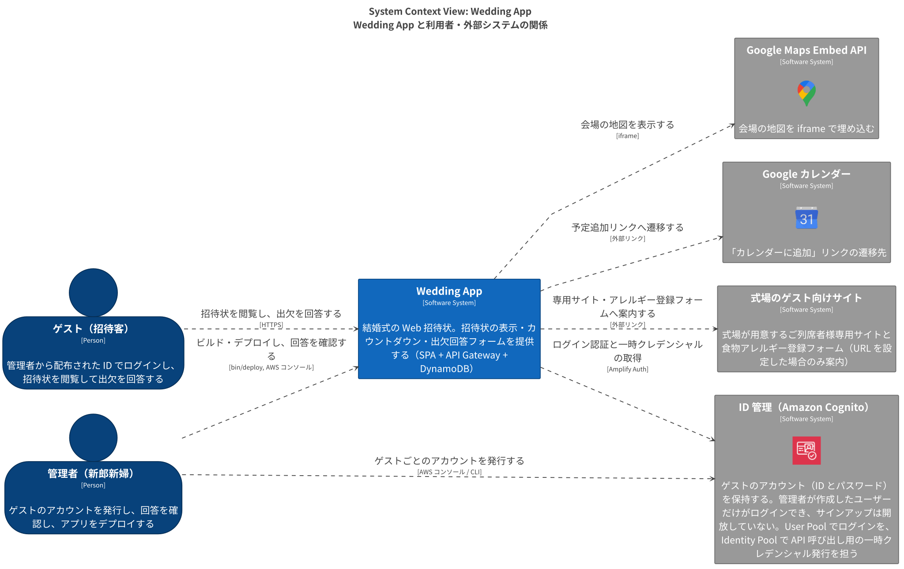
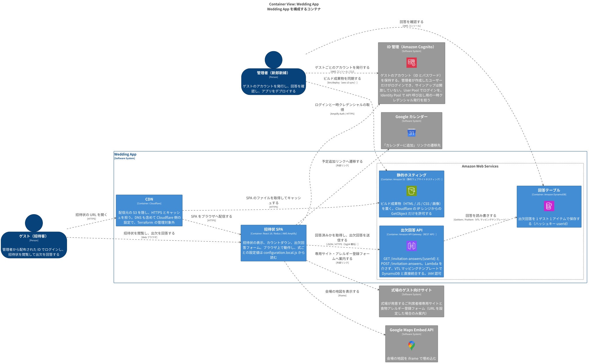

# architecture

Wedding App の構成を [C4 モデル](https://c4model.com/) で図示したものです。
上位 2 レベル、**System Context 図**（システムと利用者・外部システムの関係）と
**Container 図**（システムを構成する実行単位とデータストア）を用意しています。
Component 図（SPA 内部のコンポーネント分割）は必要になった時点で `workspace.dsl` に追記します。

| ファイル | 役割 |
| --- | --- |
| [workspace.dsl](workspace.dsl) | Structurizr DSL。**図の正**はこのファイルで、要素・関係・見た目はここで編集する |
| [structurizr-SystemContext.svg](structurizr-SystemContext.svg) | System Context 図。`workspace.dsl` から生成するので手で編集しない |
| [structurizr-Containers.svg](structurizr-Containers.svg) | Container 図。同上 |
| [export.sh](export.sh) | Docker で `workspace.dsl` を検証し、SVG を再生成するスクリプト |
| [Dockerfile](Dockerfile) | 日本語を描画できる PlantUML イメージ（`export.sh` がビルドする） |

## System Context 図

システムを 1 つの箱として扱い、誰が使い、どの外部サービスに依存しているかを示します。



### 読み方

- **ゲスト（招待客）** — 管理者が配布した ID でログインし、招待状の閲覧と出欠回答をする
- **管理者（新郎新婦）** — Cognito にゲストのアカウントを発行し、`bin/deploy` でアプリを配信し、回答を AWS コンソール（DynamoDB）で確認する
- **Wedding App** — このリポジトリ。SPA（S3 + Cloudflare）、API Gateway、DynamoDB をまとめて 1 つのシステムとして扱う。内訳は下の Container 図を参照
- **ID 管理（Amazon Cognito）** — ゲストの ID とパスワードを保持する。管理者がゲストごとにアカウントを作成し、サインアップは開放していない。アプリの一部ではなく、利用する外部サービスとして描いている
- **Google Maps Embed API / Google カレンダー / 式場のゲスト向けサイト** — 招待状から埋め込み・リンクで参照する外部サービス。式場サイトは `guestSiteUrl` / `allergyFormUrl` を設定した場合だけ案内が出る

## Container 図

Wedding App の中身を、配信経路（Cloudflare → S3 → ブラウザ）と
データの流れ（SPA → API Gateway → DynamoDB）に分けて示します。
枠は 2 種類あります。外側の青い実線が **Wedding App**（システムの境界）、
内側の点線が **Amazon Web Services**（[infra/](../../infra/) の Terraform 管理対象）です。



### 読み方

- **CDN（Cloudflare）** — 配信元の S3 を隠し、HTTPS とキャッシュを担う。DNS も含めて Cloudflare 側の設定で、Terraform では管理していないため AWS の枠の外にある
- **静的ホスティング（Amazon S3）** — `yarn build` の成果物を置く。`bin/deploy` が `aws s3 sync` で同期し、バケットポリシーで Cloudflare の IP レンジからの `GetObject` だけを許可する
- **招待状 SPA（React / Redux / Amplify）** — ブラウザ上で動く本体。S3 から配信されたあとは、Cognito・API Gateway・Google の各サービスとブラウザから直接やり取りする。ブラウザ上で動くので AWS の枠には入らない
- **出欠回答 API（Amazon API Gateway）** — `GET /invitation-answers/{userId}` と `POST /invitation-answers`。Lambda を挟まず、VTL のマッピングテンプレートで DynamoDB と直接統合している。`AWS_IAM` 認可なので、Amplify が Identity Pool の一時クレデンシャルで SigV4 署名する
- **回答テーブル（Amazon DynamoDB）** — 出欠回答を 1 ゲスト 1 アイテムで保存する（ハッシュキー `userId`）

Cognito も AWS のサービスですが、Wedding App の外にある外部システムとして扱っているため、
コンテナの枠（Amazon Web Services）には含めていません。

デモモード（`yarn start:demo`）では、SPA が起動時に Amplify の `Auth` / `API` をモックへ差し替えるため、
Cognito・API Gateway・DynamoDB のいずれにも接続せず、回答は `sessionStorage` に保存されます。
コンテナ構成そのものは変わらないので、図には描いていません。

## 図の更新手順

`workspace.dsl` を編集したら、SVG を再生成してまとめてコミットします。

```bash
docs/architecture/export.sh
```

やっていること:

```text
workspace.dsl --[structurizr]--> *.puml --[plantuml]--> *.svg
```

- Docker が必要。[structurizr/structurizr](https://hub.docker.com/r/structurizr/structurizr) と、
  [Dockerfile](Dockerfile) からビルドする PlantUML イメージを使う。初回だけビルドが走る
- **実行にはネットワーク接続が必要** — PlantUML が描画時にサービスのアイコンを URL から取得する。
  取得した画像は SVG に base64 で埋め込まれるので、閲覧側での通信は発生しない
- 中間生成物の `*.puml` は残さない（[.gitignore](.gitignore) 済み）
- 出力ファイル名は `structurizr-<ビューのキー>.svg`。ビューを増やしたらファイルも増える
- コンテナ間の関係を書くと、システム間の関係が自動で補完される（implied relationship）。
  System Context レベルで表現を変えたい関係は、`workspace.dsl` のように明示的に書いておくと補完されない

### PlantUML を使っている理由

当初は Mermaid で出力していましたが、以下の理由で PlantUML に移行しました。

- **アイコンを表示できない** — Structurizr の Mermaid エクスポーターは `icon` の指定を無視する
- **矢印とラベルが重なる** — Mermaid（dagre）はエッジのラベルをノードとして配置するため、
  関係が増えると重なって読めなくなる。設定では回避できない

Structurizr の公式ツールでも `workspace.dsl` をそのまま開けます。

```bash
# ブラウザで http://localhost:8080 を開くと、レイアウトを調整しながら図を確認できる
docker run --rm -p 8080:8080 -v "$(pwd)/docs/architecture:/usr/local/structurizr" structurizr/structurizr local
```

## アイコンの出典

- **AWS** — [awslabs/aws-icons-for-plantuml](https://github.com/awslabs/aws-icons-for-plantuml)（AWS 公式のアーキテクチャアイコン）
- **Google** — `gstatic.com` が配信している Google の公式プロダクトアイコン
